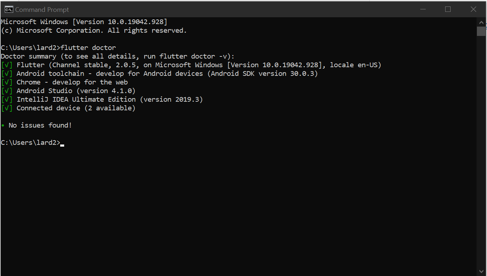
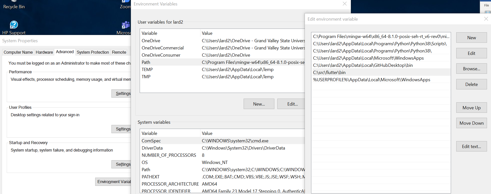
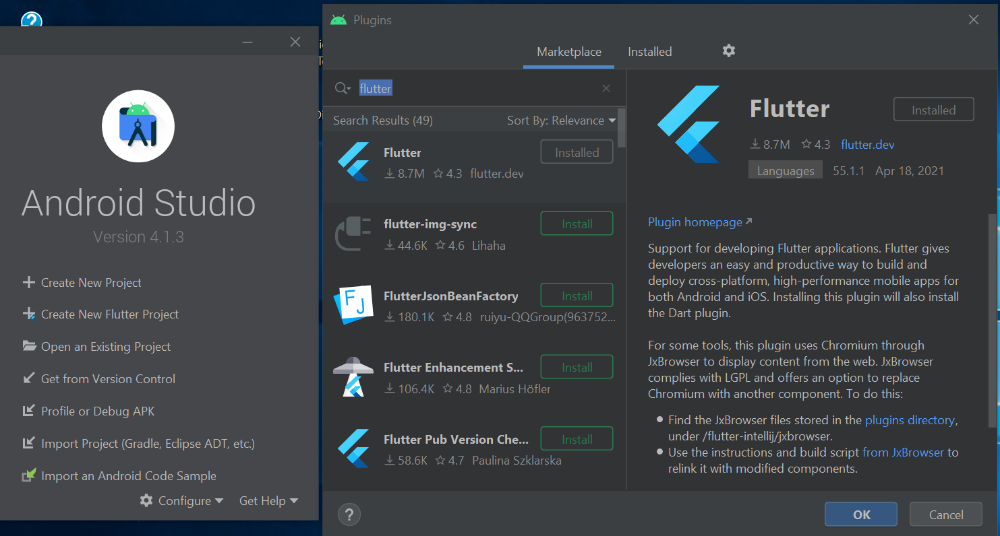
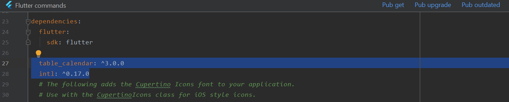

# Welcome to Flutter and Dart

## Overview

Flutter is a toolkit that allows you to create applications for Android and IOS from a single codebase in a different language entirely. Flutter runs with the dart language as its Coding language. This language was specifically designed for Flutter it has relatively simple syntax and is easy to pick up. Flutter was designed specifically for creating User Interfaces (UI’s) and that is what it is best at. In Flutter everything is essentially a widget and UI's are created with widget trees, widgets can be inside of other widgets and have text or anything else be inside of them as well. It allows for static and dynamic typing when coding variables. One of the features heavily hyped up about the Platform is the ability to see changes made to an app while it is running with the "hot-reload" feature, potentially saving coders a decent amount of time when prototyping. It also allows for ahead of time (AOT) compiling to native machine code which makes for quick startup times for apps. It also has the ability to compiler into JavaScript so it can be used to create Web Apps out of the same source code that the mobile apps were developed with.

## Getting Started

To start coding our Flutter Application, We first need a few things downloaded on our device they are as follows:

1.	[Android Studio](https://developer.android.com/studio)
2.	[Git](https://git-scm.com/downloads)
3.	[Flutter](https://flutter.dev/docs/get-started/install)

This can be done without git, but it is recommended just to pull Flutter from the GitHub Repo as described on their website. For each application click on the linked tags and follow the instructions on each website. Pay special attention to Flutter’s install instructions, make sure it is installed somewhere that does not require admin privileges. After all is installed, you can run ‘flutter doctor’ in the flutter console to make sure all the appropriate files are downloaded, and that android studio can be found. If android studio is installed and this shows that it isn’t try moving android studio into a file location that doesn’t require admin privileges. If all works smoothly it should look something like this:



As shown in this picture you can also run flutter commands in the cmd console on windows if u add flutter to your system’s path, to do so type “path” in the start menu and press enter, select “Environment Variables” from the pop up. From there select path from the list and press “Edit”, just add a new path variable by adding the file location of the flutter install. An example of this is shown below.



Before you can use flutter with android studio you need to setup some configurations first. You need a virtual device, but android studio should start you with one, you can use whatever you like. In Android studio we emulate an android phone when we run, this is taxing on a computer, especially an older one, If you enable hardware for the graphics settings of your virtual device you may get faster rendering, although it probably won’t fix the problem completely.

After this go to the main android studio pop up and tap “configure” and click “plugins”. In the marketplace type flutter and click the first plugin and install it. (as well as the dart plugin it is dependent on). The screens should look like they do below during this step.



After this you can now create and run flutter projects in Android studio, congratulations!

## Coding Demo

### Preamble/Sources

To begin Coding you need to gather the basics of the Dart Language, since this is expected of you, I will simply list sites/videos I found helpful below in learning the language itself. Shout out to Net Ninja on YouTube and Daksh on medium.com for all their helpful guides and the dart API documentation creators, they make it a lot easier to follow and learn the language. The use of the “table_calendar” dependency and user aleksanderwozniak for the prebuilt calendar implementation. As well as always thanks to Stack Overflow for helping answer questions along the way.
1.	[Net Ninja Tutorial Series](https://www.youtube.com/watch?v=1ukSR1GRtMU&list=RDCMUCW5YeuERMmlnqo4oq8vwUpg&start_radio=1&t=1)
2.	[Daksh main page](https://medium.com/@DakshHub)
3.	[dart.dev](https://dart.dev/guides)
4.	[table_calendar pub.dev](https://pub.dev/packages/table_calendar)
5.	[user aleksanderwozniak’s implementation](https://github.com/aleksanderwozniak/table_calendar)
6.	[Stack Overflow](https://stackoverflow.com/)

### Code Dependancies

To run our application, we will need to grab a few resources first. The first thing we need to do is make sure the table_calendar dependancy runs on our build.

1. [user aleksanderwozniak’s implementation](https://github.com/aleksanderwozniak/table_calendar)

This Codebase is listed to give the author credit, the rest of the code is either autogenerated when creating a new flutter app in android studio, or coded in after the fact by us. To begin go into Android Studio and select "". After it builds, go into the 'pubspec.yaml' file and type 'table_calendar: ^3.0.0' and 'intl ^0.17.0' to link the newest versions of these dependancies. Afterwards a popup will apear to run pub get to get the new dependancies. Example below.



After this we also need to add the following dart files into our lib folder 'util.dart', 'JournalEntry', and 'events_example'. These are the different files we will place our code into. The imports for each file are listed below

#### main.dart
```markdown
import 'dart:core';
import 'package:flutter/material.dart';
import 'package:intl/date_symbol_data_local.dart';
import 'package:myapp/utils.dart';
import 'events_example.dart';
import './utils.dart';
```
#### utils.dart
```markdown
import 'dart:collection';
import 'package:table_calendar/table_calendar.dart';
import 'JournalEntry.dart';
```
#### events_example
```markdown
import 'package:flutter/cupertino.dart';
import 'package:flutter/material.dart';
import 'package:table_calendar/table_calendar.dart';
import './utils.dart';
```

For the classes 'utils.dart' and 'events_example.dart', they are what create our sample calendar for our app, and were created by user aleksanderwozniak in the examples folder of their gitHub repository. 'events_example.dart' is unchanged I believe at this point so copying and giving credit directly to the source will be best in your application.

### Quick Steps to Create the application. 

### Copying events_example.dart from gitHub

[gitHub link](https://github.com/aleksanderwozniak/table_calendar/blob/master/example/lib/pages/events_example.dart)

#### Setting up JournalEntry.dart

This file is just a simple class that we will use to hold the values of the plant entries and is extended later by our events class in 'util.dart'. to throw it together it looks something like this:

```markdown
library journals;

class JournalEntry {
  late String _title;
  late String _plant;
  late int _age;
  late int _height;
  late bool _wasWatered;
  late bool _wasTrained;
  late bool _isFlowering;
  
  JournalEntry(){
    this._title       = '';
    this._plant       = '';
    this._age         = 0;
    this._height      = 0;
    this._isFlowering = false;
    this._wasTrained  = false;
    this._wasWatered  = false;
  }
  JournalEntry.full(String title, String plant, int age, int height, bool isFlowering, bool wasTrained, bool wasWatered) {
    this._title       = _title;
    this._plant       = _plant;
    this._age         = _age;
    this._height      = _height;
    this._isFlowering = _wasWatered;
    this._wasTrained  = _wasTrained;
    this._wasWatered  = _isFlowering;
  }
}
```

Take note that the library is set differently this is how dart is able to use inheritance, as classes can be grouped together.

### Setting up utils.dart

You can also copy and paste the original code here, but some editting will need to be done first before it works for our purposes. 

[utils.dart link](https://github.com/aleksanderwozniak/table_calendar/blob/master/example/lib/utils.dart)

#### Quick utils edits

to make this work for us, change the Event class to extend JournalEntry and add relavent variables and constructors, an example is below.

##### Event Class
```markdown
/// extended example events
class Event extends JournalEntry{
  String title;
  String plant;
  int    age;
  int    height;
  bool   isFlowering;
  bool   wasTrained;
  bool   wasWatered;

  Event.full(this.title, this.plant, this.age, this.height, this.isFlowering, this.wasTrained, this.wasWatered);

  @override
  String toString() => "$title: $plant, $age days old, $height inches tall, $isFlowering (flowering), $wasTrained (training), $wasWatered (watered)";
}
```
In addition a quick switch from dynamic to Event will fix kEvents for us.

##### kEvents
```markdown
final kEvents = LinkedHashMap<DateTime, List<Event>>
```

Finally adapt the hashmap to include all the items in an Event and create some filler data for us to observe.

##### kEventSource
```markdown
final _kEventSource = Map.fromIterable(List.generate(50, (index) => index),
    key: (item) => DateTime.utc(2021, 3, item * 5),
    value: (item) => List.generate(
        item % 4 + 1, (index)  => Event.full('Event $item', 'strawberry', (item%4 + index), (1 + index), false, false, true )))
  ..addAll({
    DateTime.now(): [
      Event.full('Event 1', 'grapes', 42, 25, false, true, true),
    ],
  });
```

The code aboce is useful for us as it creates some dumby data to populate our calendar.

### Main

Some of main will be there on startup but using this code in place of that will make our program run.

copy and paste from the main gitHub branch or copy and paste from below.

```markdown
void main() {
  initializeDateFormatting().then((_) => runApp(MyApp()));
}

class MyApp extends StatelessWidget {
  // This widget is the root of your application.
  @override
  Widget build(BuildContext context) {
    return MaterialApp(
      title: 'Flutter Demo',
      theme: ThemeData(
        primarySwatch: Colors.green,
      ),
      home: MyHomePage(title: 'Flutter Demo'),
    );
  }
}

class MyHomePage extends StatefulWidget {
  MyHomePage({Key? key, required this.title}) : super(key: key);
  final String title;

  @override
  _MyHomePageState createState() => _MyHomePageState();
}

class _MyHomePageState extends State<MyHomePage> {

  @override
  Widget build(BuildContext context) {
    return Scaffold(
      appBar: AppBar(
        // Here we take the value from the MyHomePage object that was created by
        // the App.build method, and use it to set our appbar title.
        title: Text(widget.title),
      ),
      body: Center(
        // Center is a layout widget. It takes a single child and positions it
        // in the middle of the parent.
        child: Column(
          // Column is also a layout widget. It takes a list of children and
          // arranges them vertically. By default, it sizes itself to fit its
          // children horizontally, and tries to be as tall as its parent.
          mainAxisAlignment: MainAxisAlignment.center,
          children: <Widget>[
            Text(
              'Welcome, press here to start',
            ),
            TextButton(
              child: Text('LogIn', style: TextStyle(fontSize: 20.0),),
              onPressed: () {
                Navigator.push(
                  context,
                  new MaterialPageRoute(builder: (context) => new ListDisplay()),
                );
              },
            ),
          ],
        ),
      ),
    );
  }
}

class DynamicList extends State<ListDisplay> {
  Event event = new Event.full(
      '',
      '',
      0,
      0,
      false,
      false,
      false);
  List<Event> events = [];
  final TextEditingController eCtrlTitle = new TextEditingController();
  final TextEditingController eCtrlPlant = new TextEditingController();
  final TextEditingController eCtrlAge = new TextEditingController();
  final TextEditingController eCtrlHeight = new TextEditingController();
  final TextEditingController eCtrlIsFlowering = new TextEditingController();
  final TextEditingController eCtrlWasTrained = new TextEditingController();
  final TextEditingController eCtrlWasWatered = new TextEditingController();

  @override
  Widget build(BuildContext context) {
    return new Scaffold(
        appBar: new AppBar(
          title: new Text("Journal Entries"),
          actions: <Widget>[
            IconButton(
              icon: Icon(Icons.ballot_rounded),
              onPressed: () {
                Navigator.push(
                  context,
                  new MaterialPageRoute(
                      builder: (context) => new HomeCalendarPage()),
                );
              },
            ),
          ],
        ),
        body: new Column(
          children: <Widget>[
            new Text(
                'Enter event title'
            ),
            new TextField(
              controller: eCtrlTitle, onSubmitted: (text) {
              event.title = text;
              eCtrlTitle.clear();
              setState(() {});
            },
            ),
            new Text(
                'Enter plant name'
            ),
            new TextField(
              controller: eCtrlPlant, onSubmitted: (text) {
              event.plant = text;
              eCtrlPlant.clear();
              setState(() {});
            },
            ),
            new Text(
                'Enter age'
            ),
            new TextField(
              controller: eCtrlAge, onSubmitted: (text) {
              event.age = int.parse(text);
              eCtrlAge.clear();
              setState(() {});
            },
            ),
            new Text(
                'Enter height'
            ),
            new TextField(
              controller: eCtrlHeight, onSubmitted: (text) {
              event.height = int.parse(text);
              eCtrlHeight.clear();
              setState(() {});
            },
            ),
            new Text(
                'Is the plant flowering? (true/false)'
            ),
            new TextField(
              controller: eCtrlIsFlowering, onSubmitted: (text) {
              event.isFlowering = toBoolean(text);
              eCtrlIsFlowering.clear();
              setState(() {});
            },
            ),
            new Text(
                'Is the plant get trained? (true/false)'
            ),
            new TextField(
              controller: eCtrlWasTrained, onSubmitted: (text) {
              event.wasTrained = toBoolean(text);
              eCtrlWasTrained.clear();
              setState(() {});
            },
            ),
            new Text(
                'Did the plant get watered? (true/false)'
            ),
            new TextField(
              controller: eCtrlWasWatered, onSubmitted: (text) {
              event.wasWatered = toBoolean(text);
              eCtrlWasWatered.clear();
              setState(() {});
            },
            ),
            TextButton.icon(
              label: Text('Create Event', style: TextStyle(
                  fontSize: 25.0, backgroundColor: Colors.green),),
              icon: Icon(Icons.add_circle_outlined),
              onPressed: () {
                events.add(event);
                print(events);
              },
            ),
          ],
        )
    );
  }
}

// retrieved from: https://pub.dev/documentation/string_validator/latest/string_validator/toBoolean.html
bool toBoolean(String str, [bool strict = false]) {
  if (strict == true) {
    return str == '1' || str == 'true';
  }
  return str != '0' && str != 'false' && str != '';
}


class ListDisplay extends StatefulWidget {
  @override
  State createState() => new DynamicList();
}

class HomeCalendarPage extends StatefulWidget {
  @override
  _HomeCalendarPageState createState() => _HomeCalendarPageState();
}

class _HomeCalendarPageState extends State<HomeCalendarPage> {
  @override
  Widget build(BuildContext context) {
    return Scaffold(
      appBar: AppBar(
        title: Text('TableCalendar Example'),
      ),
      body: Center(
        child: Column(
          mainAxisAlignment: MainAxisAlignment.center,
          children: [
            ElevatedButton(
              child: Text('Events'),
              onPressed: () => Navigator.push(
                context,
                MaterialPageRoute(builder: (_) => TableEventsExample()),
              ),
            ),
            const SizedBox(height: 12.0),
          ],
        ),
      ),
    );
  }
}
```

Here you can really see the widget tree that we are generating in our app. In Flutter everything on the UI is a widget, down to the text, this can be very confusing at times trying to find where a particular widget should go, especially after the general outline is already created. 

For Pages we create a class that extends stateless (unchanging) and stateful (changing) widgets, to navigate these pages we create a child of a widget (usually a button) and when it is pressed we change both the Navigator (stack of views) and the route which points to where to go next. 

All main widgets begin like this:

```markdown
@override
  Widget build(BuildContext context) {
    return Scaffold(
      appBar: AppBar(
        title: Text('sample'),
        ),
```

From there usually there is a body, column and an array widget of children widgets which usually form the more intricate details of our flutter pages. For each text field a widget, a textconmtroller, and the event object are used, with the event getting updated incrimentally by each different textcontroller.  After that it's just figuring our the different documentation related to dart to get a grasp of the different widgets and where they go.

Congratulations! you can now see for yourself how flutter works and you're on your way to begin coding in dart!


## Discussion & Conclusions

Flutter is a useful framework for creating simple UI that is fast loading and immediately cross platform on release. most of the code resides in a single source for the codebase, which simplifies a lot for developers. It has a lot of prebaked functionality that you can find for creating UI's which were utilized here in the form of calendar, but many pieces of code can be used together because of the widget tree style of coding in this language. 

Flutter is not the only way people can create cross-platform apps, they can do so in web languages and create web apps that work on anything. However Flutter is always an upgrade over this kind of approach as it is able to compile down into assembly code and javascript, and can be AOT compiled drastically improving startup time and responsiveness. 

It is not all sunshine and rainbows here however, While flutter may be useful in any sort of UI design, using it outside of this area gets very complicated very quickly. Although the widget tree looks nice and creates a nice hierarchy of widgets, it also can lead to very verbose looking bloaty code that can make it very difficult to find where a particular widget is. On top of this it also makes it more confusing with so many different widgets and paramaters for each widget, it can be tricky finding where a widget needs to reside to function pproperly.
